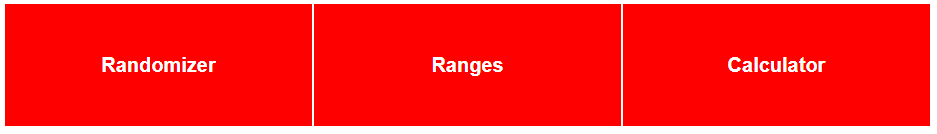

## What this is

Welcome to the README page for the Poker Browser Toolbox. This application was created by me as both a learning opportunity and to be a set of tools to help me make quick checks and calculations during my online Poker sessions.



## The tools

Currently this application has three tools:

### A Randomizer 


Once selected, it shows up right below the nav bar on the left side and can be used by clicking the "Randomize" -button. The result is a random number between 1 and 100 (inclusive). Randomization is used in Poker to make good decisions in situations where taking the same action with the same hand every time is not a good strategy.

### An on-screen calculator


A simple calculator that once selected, shows up under the nav bar on the right side. You can use this calculator to quickly calculate simple arithmetic to calculate your Pot Odds or to figure out how likely your draw is to complete, to name a few.

### A Range Matrix and a set of pre-flop profiles 


The Ranges tool uses two MongoDB databases (one collection for each position) to store cash game and tournament profiles. Those profiles can be filtered and then opened based on the position (UTG, UTG+1...), stack size (bb) and type (RFI, FRFI, F3-bet...). Opening a profile will show a name, description, type, stack size and the range inside the matrix. Profiles can be created (and currently they must if your databases don't have any), opened, edited (by toggling edit and then submitting edited inputs) and deleted (by first toggling edit and then "delete profile"). Editing or creating the range can be done by clicking on the hand combinations inside the matrix. The colors cycle between white (fold/check/not in range), green (call) and red (raise).


## The goal

The tools in the application are designed to be quickly, easily and frequently accessible during play. Any updates and additional tools are supposed to fit into that framework.

## Install

### To run locally:
Create an ATLAS URI connection parameter in "backend/.env". This is specific to individual clusters, but it will look something like this:
```
ATLAS_URI=mongodb+srv://<username>:<password>@<database cluster name>.0c5iv7s.mongodb.net/
PORT=5000
```
Instructions on how to create your connection string can be found here: https://www.mongodb.com/docs/drivers/php/laravel-mongodb/current/quick-start/create-a-connection-string/

Run build to generate static files:
```
npm install
npm run build
```

Copy the generated build directory to backend for express:
```
cp -r ./build ./backend/public
```

Start server:
```
cd backend
npm install
node server.mjs
```

If successful, you should see "MongoDB connection successful" and "Server is running on port: 5000".
Then just browse localhost:5000 to use the application

## Future updates

The Home page will have the same things listed, but I'll put them here as well:

-I want to allow out-of-order actions; Right now all of the filter buttons clear all elements of the form (or profile, in case of database buttons) given by the buttons below them. Also, the Matrix and input fields can be interacted with before all the necessary filters are in place, and clicking the remaining filters will clear the form (and you can't submit without the filters in place). This can get quite annoying as time goes on.

-Get some ideas on how to make the UI less confusing. I know how things work because I wrote this, but someone who doesn't know the code might have a more difficult time going through the profile opening, creating, editing and deleting functions.

-I want to find a way to fill range buttons with color by percentage to show that some
hands are played a certain way only sometimes. This would both make
the ranges more accurate and make the randomizer easier to use.

-I might want to add a default set of ranges if the databases are empty, 
or (way more difficult unless deployed) if there are no database connections.

-A basic explanation of ICM and a way to approximate its effect on Pot Odds.
This will be quite difficult to fit into the "quickly, easily and frequently accessible during play"-framework

-Figure out what other tools are needed since three isn't exactly very many for a "toolbox".

## Other information

The application itself is built using React.js for the front end and Node.js for the backend. Comments for the code are written with the help of ChatGPT, but the code itself is either written or collected by me.

I got the basic structure for the calculator component from following this tutorial: https://reactjsguru.com/how-to-make-calculator-in-react/

I got most of my backend code from the MongoDB mern stack tutorial: https://www.mongodb.com/languages/mern-stack-tutorial

The Azure deployment was done with the help of Apps on Azure Blog's MongoDB Atlas, Node JS and Azure App Service -tutorial: https://techcommunity.microsoft.com/t5/apps-on-azure-blog/getting-started-with-mongodb-atlas-nodejs-and-azure-app-service/ba-p/3776109


The information for the calculation rules and examples is not my own. While they are very widely used and well known in the Poker world, I still feel the need to include the sources here. There are many different sources for this stuff, but I'm going to include one for each.

For the Pot Odds calculations and examples, I think Upswing Poker shows it in a way that's easy to understand: https://upswingpoker.com/pot-odds-step-by-step/

For the 4-2 and 2-2 rules, I used a smartpokerstudy article (and podcast) to verify the information: https://smartpokerstudy.com/4-2-rule-flop-value-raises-oversized-bets-111/

For bounty tournament information, I think Upswing Poker again has a well written article not just for calculation, but basic strategy as well: https://upswingpoker.com/knockout-bounty-tournaments-progressive-ko/

## Done example ranges in test/presentation database cluster

The cash game test database is ready. Some profile lists are empty (UTG FRFI and F4Bet, BB RFI and F3Bet) because those table positions can't end up in some situations.

The tournament database is a copy of the cash game database until I study up on tournaments again and derust.
